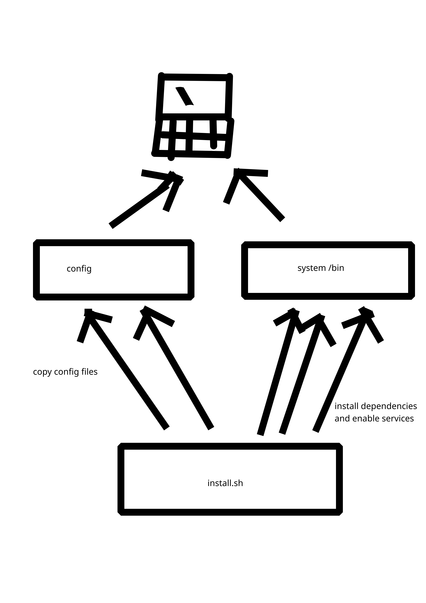

# Ark arch linux hyprland config

<p>
this config is a fork of the "simple-hyprland" github repo    

  (https://github.com/gaurav23b/simple-hyprland)   <- link
</p>

## What is so different from the github page of "simple-hyprland"
- ✅ more moodern tools
- ✅ dunst:X11 -> swaync:wayland
- ALOT MORE
- ✅ support with cutting edge changes (not as slow as simple-hyprland)

cons
-  no docs
-  can be broken (not always like only 5% chance)
-  primegen would hate this (pro for me! but not for you sucker)


# Installation:

```bash
git clone --depth=1 https://github.com/epicbruh11111/Arkconfig ~/Arkconfig
cd ~/Arkconfig/scripts/installer
chmod +x ./install.sh
sudo sh ./install.sh

```

## copy configs to your .config files without insatlling dependencies
```bash
git clone --depth=1 https://github.com/epicbruh11111/Arkconfig ~/Arkconfig
cd ~/Arkconfig/scripts
chmod +x ./copy.sh
sudo sh ./copy.sh

```


# Version: 2.5
# Update:
- documentation
- fixes
- better zsh

# Update description

start of a great wiki

testing this config right now using a VM

zsh now has auto complete, history, highlighting and git features + fastfetch runs when zsh starts


# Documentation

Just read this:
https://github.com/gaurav23b/simple-hyprland

this config is at its start point so using simple-hyprland's docs on this config is gonna be sweet
(if this config becomes huge and unsimple but I'll try to make it simple)


# Documentation for real

note: ```please read gaurav's docs before coming here```

ANOTHER note: ```the word "ricing" is tricky, everybody thinks its trying to make your desktop as cool as possible .But, no.. its not. Ricing can be something custom to you which you think is perfect for you, if the word "ricing" followed the wrong meaning then all rices are sh$t because not everybody likes it even you and me!```

last note for real:  ```Dont be scared that you cant learn anything and that everything is complicated and you cant know them all. Me my self need to read my own documentation because all I dont know EVERYTHING, no one knows everything. Knowing what is hyprland and being able to configure a .conf is all it needs to learn hyprland but sometimes there are extra stuff you need learn for example: waybar,swaync,rofi, and etc.   3 weeks experience with hyprland can make you an intermediate SO dont ive up!!```  


So I heard you want better config but you still suck?  
Or you are too lazy to join the rice race and your just dependent on me?  
anyways I'll show you how to do it and feel free to steal my config as some of them are stolen as well  
"Thanks ml4w and KooL"  


## Or This:


## Table of Contents

- [start](#documentation-for-real)
- [Introduction:](#introduction)
  - [plans](#introduction)
  - [preconfig](#configs)
  - [scripts](#scripts)
- [refresher:](#peak-of-the-iceberg)
  - [hyprland](#whats-hyprland)
- [reforms](#reforms)
- [ideas](#ideas)
- [Debugging](#debug)
- [migrating](#mig)

# Introduction

plan is simple:

- **use Kavantum manager for old GUIS**  
- **use Qt settings app for Qt apps both 6 and 5**  
- **use nwg-looks/gtk settings for gtk apps**  

now for the hardcore stuff.

- **no dunst yes swaync**
- **tofi Rythmes with tofu yuck! rofi better**
- **bit of salt,cava,btops,zsh (I'll explain what are they later)**

You dont need all of these stuff but it kind of advance and makes you more  
*ricy* in the hyprland communtiy

hyprland philosiphy/community divides into 3 categeory(hope I spelled it right):

1. too much ricing,animations,config files guy

2. the guy with the "steve" ricing (no ricing, just functionality and blood)

3. rice/use it in a way it never got designed for (windows 7 themes, and x11 apps/services)

And yes I made all of that up!

the gurav's config follows 2   
us? we will follow 1.5 (50% *"1"* 50% *"2"*)

------------------------
Oh yeah dont forget to git clone the repo because we will need it:

lets talk about the folders: scripts,configs

## Configs

This folder has all of the configs, you can drag the sub-folders from this dir
to .config and you will have a functionable Arkconfig if you installed the dependencies


## scripts  

We will look on three scripts:
- install.sh
- copy.sh
- extra.sh

### 1. install.sh
this is the main script for installing dependencies, enabling/starting services, copy configs, and log everything in a log file inside the same directory



### 2. copy.sh
the only think it does is copy ~/Arkconfig/configs to ~/.config
.nothing else


### 3. extra.sh
this script is completely optional and unrecommended because all it does is just install apps **I NEED**

---
# Peak of the iceberg

Now that you understood the plan from both:
- changes onto old config
- varients of scripts used for installation

Lets go deeper into configuration

## What's hyprland?

Hyprland also known as "hyprwm/hypr window manager" is a tiling window manager used to... manage windows(duh!).

### Example:

```
|---------------------|
|                     |
|         1           |             
|                     |
|---------------------|
            |
            v
|----------|----------|
|          |          | 
|    1     |    2     |  
|          |          |
|----------|----------|

            |
            v

|----------|----------|
|          |     2    | 
|    1     |----------|      
|          |     3    |
|----------|----------|
        |
        v

        etc

```

And it has alot of features, I can turn this documentation to a wekipedia if I managed to write all of it's features.

Now, I'll tell you the common knowledge in hyprland:

### 1. hyprland uses something called wayland  
Yeah so when using something be carful as the package might require
X11 which can break stuff unless you have the ***xwayland***(prebuilt)
but using an extra layer aka xwayland can cut performance so using a wayland version
is your best bet for example:

dunst is X11 (pretty old)  
swaync is wayland (sway is also a wayland wm)

what are you gonna choose:  
  **/---**  
 **|** A) dunst  
 **|** B) swaync  
 **|** C) argue in reddit on how hyprland sucks  
 **|** D) upgrade your pc for windows 11  
  **\ ----**

of cource it's option C...~ I mean B!

### Vocabulary:
- wayland: its the software which tells your kernel what to use to run hyprland
- X11: an old woftware which also tells your kernel and DE/WM what to do
- xwayland: sometimes app only work on x11 so this is used to run x11 apps on wayland but has performance issues
- WM/DE: wm stands for window manager while DE stands for desktop enviorment
---
### 2. hyprland uses .conf and hyprctl for managing stuff

go to ~/.config/hypr and you will find a hyprland.conf which will show the configurations which you can use. Also hyprctl is a command used to manage hyprland it's self

---
## swaync

### Swaync config


Swaync divides into two stuff:

swaync-deamon  
swaync-client


## vocabulary:
- deamon: fancy term for service running for a specific field
- client: something you see as a user  


swaync-deamon or swaync is the service of fetching and alerting notifications from the sweet dbus stations for notifcations (dbus is the manager for all of these services requests)

just run the command:  
```bash
GDK_BACKEND=wayland swaync
```

or in hyprland:

```bash
exec-once=GDK_BACKEND=wayland swaync
```

GDK_BACKEND is the variable which tells the swaync what map we are using
like wayland is the highway while x11 is the normal roads

you cant drive in highwayspeed in normal streets so does swaync


## badass swaync-client / styling swaync

swaync-client is the panel in the image I provided in the start of this chapter.

Just use my config:

```bash
# clone the repo at "~"  or "home/$USER"
cp -r ~/Arkconfig/configs/swaync ~/.config/
# also if you have an existing swaync config
# this wont work and you have to eliminate the original and
# rerun this command just make sure you have backed up the original
# config
```
swaync configs divide into two files:  
config.json for layout
style.css for styling

{REST OF DOUMENTATION COMING SOON}